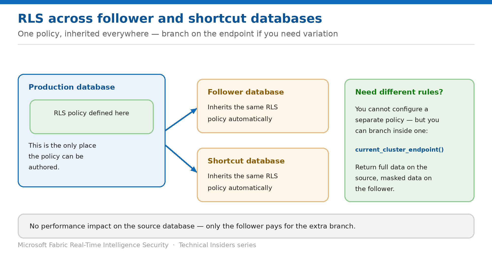

# Control Access Across Follower and Shortcut Databases

> One policy, inherited everywhere — and how to vary it without a second policy.

*Series: Granular data access · Layer 3 (4 of 4) · Audience: Data engineers & DB admins · Level 300*

Follower and shortcut databases share their source's data — and its **row level security policy**. This entry covers what that means in practice, and the supported technique for serving different data to followers without maintaining a second policy.

## Scenario — when to use this

You share an Eventhouse database with another team through a follower or shortcut database. They should see the data, but not the personal identifiers your own team relies on. Configuring a separate policy on the follower is the obvious approach — and it isn't possible.

Reach for this entry whenever you share a KQL database downstream, or when a follower is showing more (or less) than you intended.

For more detail on how this option works, see:

- [Microsoft Fabric security white paper — Microsoft Learn](https://learn.microsoft.com/en-us/fabric/security/white-paper-landing-page)
- [Row level security policy — Microsoft Learn](https://learn.microsoft.com/en-us/kusto/management/row-level-security-policy?view=microsoft-fabric)
- [Manage view access to tables — Microsoft Learn](https://learn.microsoft.com/en-us/kusto/management/manage-table-view-access?view=microsoft-fabric)

## What you'll set up

- An understanding of what followers inherit automatically.
- Different data served to followers where required.
- A sharing model that doesn't duplicate policy logic.



*Figure 9 — Branch on the cluster endpoint to serve different data downstream.*

## Prerequisites

- You hold **Database Admin** permissions on the source database.
- A follower or shortcut database already exists, or you can create one.
- You know the cluster endpoint of the source database.

## Step 1 — Know what is inherited

- The RLS policy you configure on the **production database also takes effect in follower databases**.
- The same applies to **shortcut databases**.
- **You can't configure different RLS policies** on the production and follower or shortcut databases.

> **This is a feature, not a gap** — Inheritance means a follower cannot be used to bypass the source's restrictions — which is exactly what you want. The technique below lets you tighten further for followers, not loosen.

## Step 2 — Branch on the cluster endpoint

Use `current_cluster_endpoint()` inside the policy to return different results depending on where the query runs:

```kusto
.create-or-alter function RLSForCustomersTables() {
    let IsProductionCluster = current_cluster_endpoint() == "mycluster.eastus.kusto.windows.net";
    let DataForProductionCluster = TempTable | where IsProductionCluster;
    let DataForFollowerClusters = TempTable
        | where not(IsProductionCluster)
        | extend EmailAddress = "****";
    union DataForProductionCluster, DataForFollowerClusters
}
```

The source database serves full data; the follower serves the masked variant — from a single policy definition.

## Step 3 — Consider a follower as an access-control tool

Beyond RLS, a follower database is itself a useful boundary. Create a database shortcut following **only the tables** you want to share, and grant the consuming team roles on the follower rather than on your production database.

1. Create the follower or shortcut database.
2. Follow only the tables the consuming audience needs.
3. Grant that audience KQL roles on the follower.
4. Keep your production database's principal list limited to your own team.

## Validate

- A query on the **source** returns full data for permitted principals.
- The same query on the **follower** returns the masked or filtered variant.
- The follower exposes only the tables you chose to follow.
- Consuming-team principals appear on the follower's principal list, not the source's.

## Limitations & gotchas

- **You cannot configure a separate RLS policy** on a follower or shortcut database.
- The endpoint-branching technique has **no performance impact on the source database** — only followers pay for the extra branch, proportional to the complexity of the follower path.
- Followers inherit policy changes automatically; test both sides after any edit.
- A follower is not a security boundary for data it does follow — restrictions still come from the policy.

## Rollback

1. Remove the endpoint branch from the policy function to serve identical data everywhere.
2. Drop the follower database to remove that sharing path entirely.
3. Re-test both source and follower after any change.

## References

- [Row level security policy — Microsoft Learn](https://learn.microsoft.com/en-us/kusto/management/row-level-security-policy?view=microsoft-fabric)
- [Manage view access to tables — Microsoft Learn](https://learn.microsoft.com/en-us/kusto/management/manage-table-view-access?view=microsoft-fabric)
