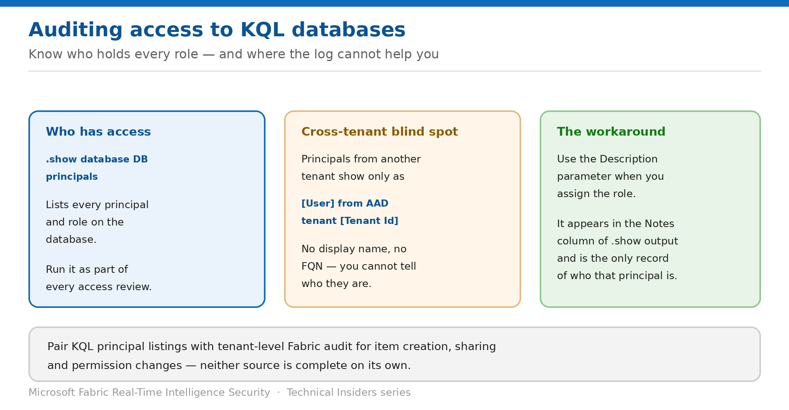

# Audit Who Has Access to a KQL Database

> List every principal and role — and understand the cross-tenant blind spot.

*Series: Governance & monitoring · Layer 4 (1 of 2) · Audience: Fabric admins & security teams · Level 300*

This entry covers producing a defensible answer to "who can read this database?" — the commands that list principals, what the output contains, and the one case where it tells you almost nothing.

## Scenario — when to use this

An auditor asks who had access to a telemetry database last quarter. Between workspace roles, KQL database roles, follower databases and service principals, the answer lives in several places — and one category of principal shows up without a name at all.

Reach for this entry when preparing for an audit, running a periodic access review, or investigating an incident.

For more detail on how this option works, see:

- [Microsoft Fabric security white paper — Microsoft Learn](https://learn.microsoft.com/en-us/fabric/security/white-paper-landing-page)
- [Manage database security roles — Microsoft Learn](https://learn.microsoft.com/en-us/kusto/management/manage-database-security-roles?view=microsoft-fabric)
- [Track user activities in Microsoft Fabric — Microsoft Learn](https://learn.microsoft.com/en-us/fabric/admin/track-user-activities)

## What you'll set up

- A complete list of principals and roles per database.
- Cross-tenant principals identified despite the display limitation.
- KQL-level access correlated with tenant-level audit.



*Figure 10 — Principal listings, and where the output cannot help you.*

## Prerequisites

- You hold at least **Database Admin** permissions to run the principal commands.
- Access to the Fabric or Microsoft 365 audit log for tenant-level events.
- A list of the databases in scope, including any follower or shortcut databases.

## Step 1 — List the principals

```kusto
// Every principal and role on the database
.show database Samples principals

// Your own roles, useful when verifying a change
.show database Samples principal roles
```

The output includes the role, principal type, display name, object ID, and fully qualified name — enough to identify most principals directly.

## Step 2 — Handle the cross-tenant blind spot

The output behaves differently depending on where the principal comes from:

- **Same tenant** — the fully qualified name (FQN) is shown.
- **Different tenant** — the display name does **not** show the FQN. It shows only `[User/Group/Application] from AAD tenant [Tenant Id]`.

> **Annotate at grant time, or lose the information** — There is no way to recover a cross-tenant principal's identity from the listing afterwards. Assign the principal a role using the **Description** parameter, which appears in the **Notes** column — that description is the only record of who they are.

```kusto
// Record who the principal is at the moment you grant access
.add database Samples viewers ('aadapp=<client-id>;<tenant>')
    'Partner ingestion app - Contoso - owner: jane@contoso.com'
```

## Step 3 — Cover the other access paths

A KQL principal listing is necessary but not sufficient. Complete the picture with:

- **Workspace roles** — from **Manage access** on each workspace hosting RTI items.
- **Follower and shortcut databases** — each has its own principal list; run the same command there.
- **Eventstream custom endpoints** — service principals and SAS keys granting ingestion access (entry 02).
- **Tenant audit** via *Track user activities in Fabric*, for item creation, sharing and permission changes.

## Step 4 — Make it repeatable

1. Script the `.show database ... principals` command across every database in scope.
2. Export the results with a timestamp so you can compare between review cycles.
3. Flag any principal without a meaningful description, and annotate it.
4. Flag any `admins` assignment held by a service principal — those warrant justification.
5. Re-run after every significant change, not only at review time.

## Validate

- The principal list matches your expected access model.
- A principal you recently added appears with the correct role and description.
- A dropped principal no longer appears.
- Follower databases have been listed separately.
- Cross-tenant principals carry descriptions identifying them.

## Limitations & gotchas

- **Cross-tenant principals show no display name or FQN** — descriptions are the only mitigation, and only if added at grant time.
- The command requires **Database Admin** permissions, so reviewers need that access or a scripted export.
- Principal listings don't show *when* access was granted — pair with tenant audit for the timeline.
- Followers and shortcuts must be listed separately; they don't appear in the source's list.
- Workspace roles are invisible here — they're a separate system (entry 03).

## Rollback

1. Auditing is a read activity; there is nothing to roll back.
2. If the review identifies excess access, remove it with `.drop database <DatabaseName> <role> ('<principal>')`.

## References

- [Manage database security roles — Microsoft Learn](https://learn.microsoft.com/en-us/kusto/management/manage-database-security-roles?view=microsoft-fabric)
- [Track user activities in Microsoft Fabric — Microsoft Learn](https://learn.microsoft.com/en-us/fabric/admin/track-user-activities)
- [Data security overview (OneLake) — Microsoft Learn](https://learn.microsoft.com/en-us/fabric/onelake/security/get-started-security)
