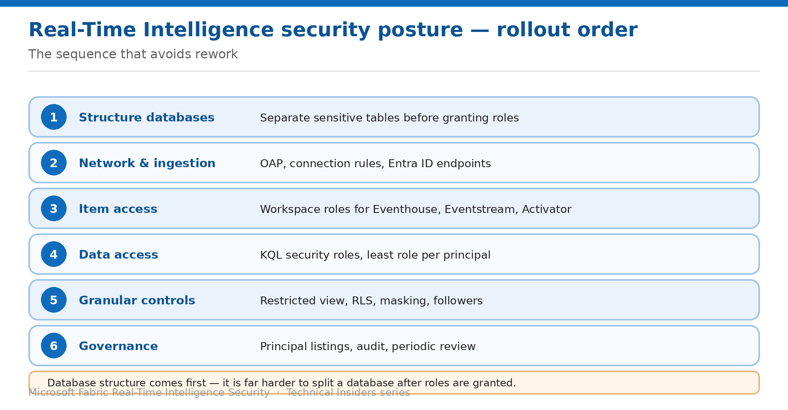

# Assemble a Real-Time Intelligence Security Posture

> The order to apply these controls in, starting with the one that's hardest to change later.

*Series: Governance & monitoring · Layer 4 (2 of 2) · Audience: Fabric admins & architects · Level 300*

The preceding ten entries each solve one problem. This capstone puts them in order and adds the review cadence that keeps the result accurate.

Real-Time Intelligence has one sequencing rule that matters more than the rest: **database structure comes first**. The viewer role is database-wide, so your database boundaries *are* your coarse access boundaries — and changing them after ingestion is under way is significant work.

## Scenario — when to use this

You're standing up a new Eventhouse, or inheriting one with roles granted ad hoc over time. Applying these controls in the wrong order means restructuring databases after they're populated and re-granting every role.

Reach for this entry when planning a rollout, onboarding a new Eventhouse, or reviewing an existing one against a target posture.

For more detail on how this option works, see:

- [Microsoft Fabric security white paper — Microsoft Learn](https://learn.microsoft.com/en-us/fabric/security/white-paper-landing-page)
- [Manage view access to tables — Microsoft Learn](https://learn.microsoft.com/en-us/kusto/management/manage-table-view-access?view=microsoft-fabric)
- [Manage database security roles — Microsoft Learn](https://learn.microsoft.com/en-us/kusto/management/manage-database-security-roles?view=microsoft-fabric)

## What you'll set up

- A sequenced rollout plan across all four layers.
- A control map you can review an Eventhouse against.
- A repeatable review cadence.

*Figure 11 — Rollout order: database structure first, because it is the hardest to undo.*

## The rollout order

| # | Step | What you do | Entries |
| --- | --- | --- | --- |
| 1 | Structure databases | Separate sensitive tables into their own databases | 06 |
| 2 | Network & ingestion | OAP, Entra ID endpoints for producers | 01, 02 |
| 3 | Item access | Workspace roles for Eventhouse, Eventstream, Activator | 03 |
| 4 | Data access | KQL security roles, least role per principal | 04, 05 |
| 5 | Granular controls | Restricted view, RLS, masking, followers | 06–09 |
| 6 | Governance | Principal listings, audit, periodic review | 10, 11 |

> **Why structure comes first** — Every other control assumes your database boundaries are right. Because `viewers` cannot be scoped to tables, the database *is* the boundary — and moving tables between databases after ingestion means reworking ingestion paths, followers, dashboards and every role assignment that referenced them.

## Step 1 — Baseline the environment

1. List every Eventhouse, KQL database, Eventstream and Activator in scope.
2. For each database, run `.show database <DatabaseName> principals` and record the output.
3. List every follower and shortcut database, and run the same command there.
4. Record which Eventstreams use SAS keys versus Entra ID authentication.
5. Note which tables carry RestrictedViewAccess or RLS policies today.

## Step 2 — Apply the layers in order

1. **Structure:** move sensitive tables into their own databases before granting anything (06).
2. **Network:** enable OAP if required, communicating the Copilot impact (01); migrate Eventstream producers to Entra ID (02).
3. **Item access:** right-size workspace roles, understanding they don't convey data access (03).
4. **Data access:** assign the minimum KQL role per principal, using `ingestors` for write-only producers (04); move automation to service principals (05).
5. **Granular:** apply RestrictedViewAccess or RLS where needed (06, 07), add masking (08), and check what followers inherit (09).
6. **Governance:** script principal listings and set a review cadence (10).

## Step 3 — Watch the interactions

Several controls in this series interact in ways that only surface at configuration time:

- **RestrictedViewAccess and RLS are mutually exclusive** on the same table — decide which per table.
- **RLS blocks on update policies without managed identity**, and on continuous exports without impersonate authentication — fix those first if you plan to use RLS.
- **RLS applies to admins too** — including whoever wrote it.
- **Followers inherit the source policy** and cannot have their own.
- **`unrestrictedviewers` requires another role alongside it.**

## End-to-end validation

- **Network:** Event Hubs ingestion works under OAP; external destinations are blocked; the team knows Copilot is unavailable.
- **Ingestion:** each producer authenticates as its own principal, and revoking one leaves the others running.
- **Item access:** a workspace role alone yields no data; the pairing is documented.
- **Data access:** producers can write but not query; consumers can read only their permitted tables.
- **Granular:** RLS filters and masks correctly for every defined audience, and for admins.
- **Governance:** principal listings are scripted, exported and annotated, including cross-tenant entries.

## Limitations & gotchas

- **Eventhouse outbound access protection is in public preview** — re-verify before publishing standards from it.
- **The viewer role cannot be scoped to tables** — structure accordingly.
- **RLS replaces access for everyone**, admins included.
- **Cross-tenant principals are unidentifiable** in listings unless annotated at grant time.
- **Copilot stops working** under OAP.
- Two permission systems mean access reviews must cover both, every time.

## Review cadence

1. Re-run principal listings quarterly across every database, including followers.
2. Review workspace roles on the same cycle.
3. Re-check RLS policies after any schema change that adds a sensitive column.
4. Re-validate Eventstream authentication whenever a new producer is onboarded.
5. Re-verify preview capabilities after each Fabric release that touches Real-Time Intelligence.

## References

- [Manage database security roles — Microsoft Learn](https://learn.microsoft.com/en-us/kusto/management/manage-database-security-roles?view=microsoft-fabric)
- [Row level security policy — Microsoft Learn](https://learn.microsoft.com/en-us/kusto/management/row-level-security-policy?view=microsoft-fabric)
- [Manage view access to tables — Microsoft Learn](https://learn.microsoft.com/en-us/kusto/management/manage-table-view-access?view=microsoft-fabric)
- [Workspace outbound access protection for Eventhouse (preview) — Microsoft Learn](https://learn.microsoft.com/en-us/fabric/security/workspace-outbound-access-protection-eventhouse)
- [Microsoft Fabric security white paper — Microsoft Learn](https://learn.microsoft.com/en-us/fabric/security/white-paper-landing-page)
