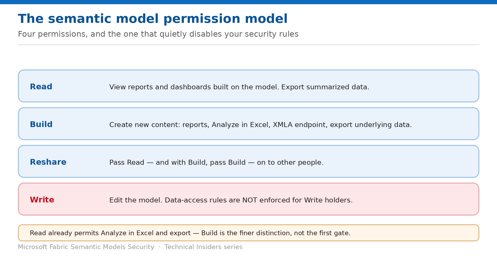

# Understand the Semantic Model Permission Model

> Read, Build, Reshare and Write — and the one that silently disables your security rules.

*Series: Access & permissions · Layer 1 (1 of 3) · Audience: Fabric admins & model authors · Level 300*

Before writing a single security rule, you need to know what each semantic model permission grants. This entry sets that out — including the fact that **data-access rules are not enforced for users with Write permission**, which invalidates a great deal of well-intentioned RLS.

## How to read this series

This is the first of eleven entries on securing Fabric semantic models — permissions first, then row and object security, then connection identity, then governance. Every entry is written as a **prescriptive, step-by-step runbook**, not a conceptual overview: exact prerequisites, the portal and DAX actions, a validation step to prove the control works, the current limitations, and a rollback.

The *why* behind each control is kept deliberately short so the steps stay front and centre. For deeper technical rationale, use the **Microsoft Fabric security white paper** as the companion reference; each entry also links the specific product documentation in its **References** section.

- [Microsoft Fabric security white paper — Microsoft Learn](https://learn.microsoft.com/en-us/fabric/security/white-paper-landing-page)

## Scenario — when to use this

You've been asked to confirm that the finance model only shows each regional manager their own numbers. RLS roles exist and look correct. But the managers were given Contributor access so they could build their own reports — which means the rules have never applied to a single one of them.

Reach for this entry before designing any model security, and whenever you're auditing whether existing rules actually take effect.

For more detail on how this option works, see:

- [Microsoft Fabric security white paper — Microsoft Learn](https://learn.microsoft.com/en-us/fabric/security/white-paper-landing-page)
- [Build permission for shared semantic models — Microsoft Learn](https://learn.microsoft.com/en-us/power-bi/connect-data/service-datasets-build-permissions)
- [Row-level security (RLS) with Power BI — Microsoft Learn](https://learn.microsoft.com/en-us/fabric/security/service-admin-row-level-security)

## What you'll set up

- A clear understanding of what each permission grants.
- Knowledge of which permission disables data-access rules.
- An access model where your rules apply to the people they're written for.

*Figure 1 — Four permissions, and the one that turns off your data-access rules.*

## Prerequisites

- Access to a semantic model and its **Manage permissions** page.
- Visibility of the workspace roles assigned in the hosting workspace.
- A list of the audiences that consume the model.

## Step 1 — Know what each permission grants

| Permission | What it grants |
| --- | --- |
| Read | View reports and dashboards built on the model. Export summarized data. |
| Build | Create new content on the model — reports, dashboards, pinned Q&A tiles, paginated reports. Also required to export underlying data, use Analyze in Excel, and access the XMLA endpoint. |
| Reshare | Pass permissions on to others. With Reshare and Build together, you can grant Build when sharing a report or dashboard. |
| Write | Edit the semantic model. Critically, data-access rules are NOT enforced for users with Write permission. |

> **The Write behaviour is the load-bearing fact** — **Semantic model data-access rules are not enforced for users who have Write permission on the model.** Conversely, they do apply to users assigned the Viewer workspace role. Every RLS and OLS decision follows from this.

## Step 2 — Understand where Read ends and Build begins

Build is a refinement of Read, not the first gate. Microsoft's documentation is explicit that users with Read via app permissions, sharing, or workspace access **already** have the right to build content using Analyze in Excel or Export.

- **Read** lets someone consume existing reports and export summarized data.
- **Build** adds creating new content, exporting underlying data, and XMLA endpoint access.
- If a report outside the model's workspace uses your model, **you can't delete the model** — you'll get an error.

## Step 3 — Audit who holds what

1. Open the semantic model's **Manage permissions** page and list direct grants.
2. Open the hosting workspace's **Manage access** and list role assignments.
3. Flag every user or group holding **Contributor or higher** — data-access rules won't apply to them.
4. Flag every app audience granted Build on the underlying model.
5. Compare that list against the audiences your RLS roles were written for.

## Validate

- A user with **Read only** can view reports but cannot create new content on the model.
- A user with **Build** can use Analyze in Excel and export underlying data.
- A user with **Write** or a Contributor role sees **unfiltered** data despite RLS being configured.
- A **Viewer** sees data filtered by their assigned RLS role.

## Limitations & gotchas

- **Data-access rules aren't enforced for Write permission holders** — including everyone with Contributor or above.
- Read already permits Analyze in Excel and summarized export; Build is the finer distinction.
- Removing Build leaves users able to view reports but not edit them or export underlying data.
- Users with only Read can still export **summarized** data.
- A model can't be deleted while a report in another workspace uses it.

## Rollback

1. Adjust direct grants on the **Manage permissions** page.
2. Change workspace role assignments in **Manage access**.
3. Remember that downgrading someone to Viewer is what makes RLS start applying to them.

## References

- [Build permission for shared semantic models — Microsoft Learn](https://learn.microsoft.com/en-us/power-bi/connect-data/service-datasets-build-permissions)
- [Row-level security (RLS) with Power BI — Microsoft Learn](https://learn.microsoft.com/en-us/fabric/security/service-admin-row-level-security)
- [Roles in workspaces in Microsoft Fabric — Microsoft Learn](https://learn.microsoft.com/en-us/fabric/fundamentals/roles-workspaces)
