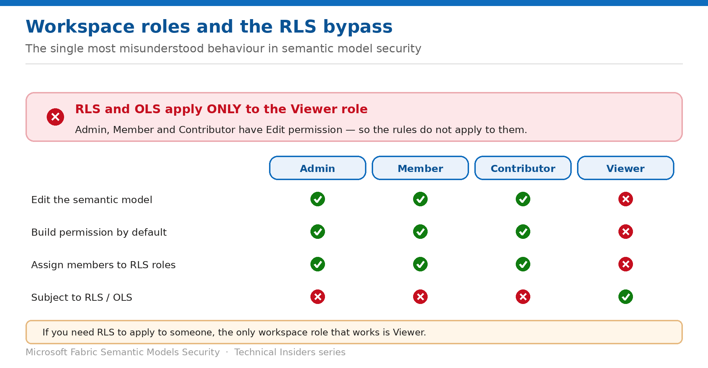

# Control Access with Workspace Roles

> Why row-level security applies only to Viewers — and what that means for your design.

*Series: Access & permissions · Layer 1 (2 of 3) · Audience: Fabric admins · Level 300*

This entry covers the single most consequential rule in semantic model security: **RLS and OLS apply only to users in the Viewer role**. Admin, Member and Contributor have Edit permission on the model, so the rules don't apply to them at all.

## Scenario — when to use this

Your RLS roles are correct, your DAX is right, and Test as role behaves exactly as expected. In production, half the audience sees everything — because they hold Contributor so they can build their own reports.

Reach for this entry before assigning any workspace role in a workspace containing secured models, and as the first diagnostic step whenever RLS appears not to be working.

For more detail on how this option works, see:

- [Microsoft Fabric security white paper — Microsoft Learn](https://learn.microsoft.com/en-us/fabric/security/white-paper-landing-page)
- [Row-level security (RLS) with Power BI — Microsoft Learn](https://learn.microsoft.com/en-us/fabric/security/service-admin-row-level-security)
- [Roles in workspaces in Microsoft Fabric — Microsoft Learn](https://learn.microsoft.com/en-us/fabric/fundamentals/roles-workspaces)

## What you'll set up

- Workspace roles assigned so security rules apply to the intended audience.
- An understanding of the trade-off between self-service and enforcement.
- A documented decision for audiences that need both.

*Figure 2 — The bypass that invalidates more RLS implementations than any other factor.*

## Prerequisites

- You are a workspace **Admin** or **Member**.
- You know which audiences must be subject to RLS or OLS.
- Entra **security groups** exist for those audiences.

## Step 1 — Understand the rule

- **RLS only restricts data access for users with Viewer permissions.** It doesn't apply to workspace Admin, Member, or Contributor roles.
- **OLS only applies to Viewers** for the same reason — those roles have Edit permission on the model.
- **Even Viewers with Build permission remain subject to RLS.** If they use Analyze in Excel, their view is still restricted.

> **The design consequence** — If you want RLS to apply to people in a workspace, **you can only assign them the Viewer role**. There is no configuration that makes rules apply to a Contributor.

## Step 2 — Resolve the self-service tension

The common objection is that Viewers can't build their own content. They can — you just grant it differently:

1. Assign the audience the **Viewer** workspace role.
2. Grant **Build permission** on the semantic model directly, or through an app audience.
3. They can now create reports and use Analyze in Excel, and **RLS still applies**.
4. Reserve Contributor for people who genuinely need to edit the model itself.

> **Viewer plus Build is the pattern** — This combination is what most organisations actually want: self-service report building, with data-access rules intact. Granting Contributor to enable self-service is the mistake.

## Step 3 — Assign through groups

1. Create or identify an Entra **security group** per audience.
2. Open **Workspace → Manage access** and add the group with the **Viewer** role.
3. Grant Build on the model to that group where self-service is needed.
4. Manage ongoing membership through the group rather than the workspace ACL.

## Validate

- A Viewer in an RLS role sees only their permitted rows.
- The same user with **Build** added still sees only their permitted rows in Analyze in Excel.
- A Contributor sees **all** rows despite the same RLS role — confirming the documented bypass.
- **Manage access** lists groups rather than individuals.

## Limitations & gotchas

- **There is no way to apply RLS to a Contributor.** Downgrade to Viewer or accept unfiltered access.
- Workspace roles are workspace-wide — you can't scope them per model.
- Model owners and anyone with Write bypass the rules regardless of workspace role.
- Users who aren't assigned to any RLS role typically see **no data**, because RLS is enforced but no matching role applies.
- Group membership changes take effect on the next token refresh.

## Rollback

1. Change the assignment in **Workspace → Manage access**.
2. Note that upgrading someone from Viewer to Contributor **stops RLS applying to them immediately**.

## References

- [Row-level security (RLS) with Power BI — Microsoft Learn](https://learn.microsoft.com/en-us/fabric/security/service-admin-row-level-security)
- [Object-level security (OLS) with Power BI — Microsoft Learn](https://learn.microsoft.com/en-us/fabric/security/service-admin-object-level-security)
- [Roles in workspaces in Microsoft Fabric — Microsoft Learn](https://learn.microsoft.com/en-us/fabric/fundamentals/roles-workspaces)
