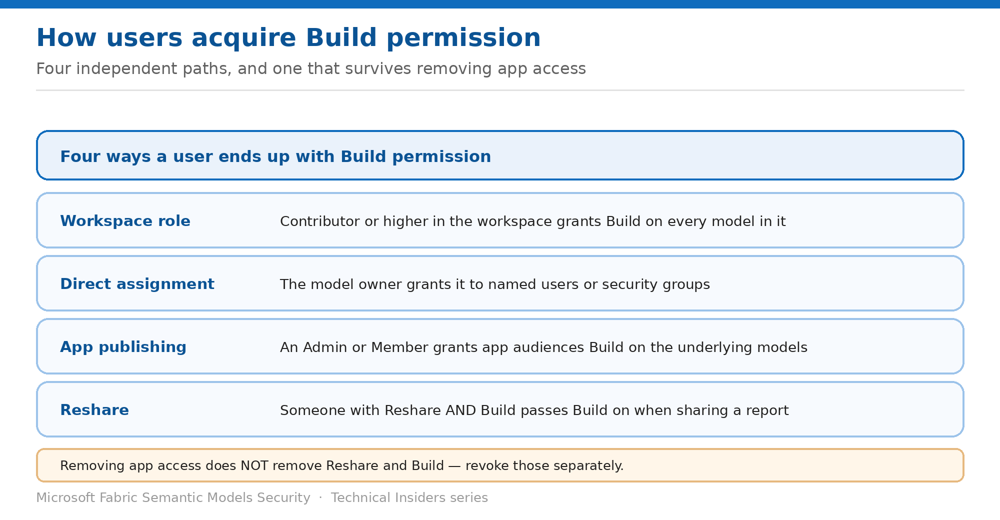

# Manage Build Permission

> Four ways users acquire it, and the one that survives removing app access.

*Series: Access & permissions · Layer 1 (3 of 3) · Audience: Model owners & admins · Level 300*

**Build** permission lets someone create new content on your model, export underlying data, and reach the XMLA endpoint. This entry covers every way users acquire it — because revoking it from one path leaves the others intact.

## Scenario — when to use this

You remove someone from a Power BI app, assuming their access is gone. They can still connect to the underlying semantic model in Excel, because removing app access doesn't automatically remove Reshare and Build.

Reach for this entry when auditing who can extract data from a model, and whenever someone leaves a project or the organisation.

For more detail on how this option works, see:

- [Microsoft Fabric security white paper — Microsoft Learn](https://learn.microsoft.com/en-us/fabric/security/white-paper-landing-page)
- [Build permission for shared semantic models — Microsoft Learn](https://learn.microsoft.com/en-us/power-bi/connect-data/service-datasets-build-permissions)

## What you'll set up

- A complete list of who holds Build and how they got it.
- Build revoked from every path when access should end.
- A defined process for handling access requests.

*Figure 3 — Four independent acquisition paths.*

## Prerequisites

- You are the semantic model owner, or hold Admin, Member or Contributor in the workspace.
- Access to the model's **Manage permissions** page.
- Access to app management if the model is distributed through an app.

## Step 1 — Know the four acquisition paths

| Path | How it happens |
| --- | --- |
| Workspace role | Contributor or higher grants Build on every model in the workspace, plus permission to copy reports |
| Direct assignment | The model owner grants Build to users or security groups on the Manage permissions page |
| App publishing | An Admin or Member decides during app publishing that app audiences also get Build on underlying models |
| Reshare | Someone with Reshare and Build shares a report and specifies that recipients also get Build |

## Step 2 — Remove Build correctly

Removing Build differs by path. For a model distributed through an app:

1. In the workspace list view, select **Update app**.
2. Select the **Audience** tab.
3. In the **Edit Audience** pane, hover over the person or group and select the trash icon.
4. Select **Update app**.
5. Then follow **Manage semantic model access permissions** to remove permissions from users with existing direct access.

> **Removing app access is not enough** — If you distribute an app from a workspace, **removing people's access to the app doesn't automatically remove their Reshare and Build permissions.** Both steps are required.

When you take away Build, users can still see reports built on the model but can no longer edit them or export underlying data. Users with only Read can still export **summarized** data.

## Step 3 — Configure how users request Build

By default, users without Build who attempt an action requiring it get a dialog that emails the model owner. You can change this:

1. Open the semantic model's **settings**.
2. Find the **Request access** options.
3. Choose the default — requests arrive by email and you act on them — or provide **instructions** instead.
4. If you provide instructions, enter plain text; HTML and code formatting render as plain text.

> **Your email becomes visible** — When you provide specific instructions, **your email address is visible to users who request access**. Use a shared mailbox or team alias if that's a concern.

## Validate

- A user with Build can use **Analyze in Excel** on the model.
- After removal from **all** paths, the same user can view reports but not connect in Excel.
- A user without Build attempting to create a report sees your configured request experience.
- The **Manage permissions** page reflects the intended list.

## Limitations & gotchas

- **Removing app access does not remove Reshare and Build** — revoke separately.
- Contributor or higher confers Build automatically on every model in the workspace.
- Users with Read can still export summarized data after Build is removed.
- Build is required for the **XMLA endpoint** — a common overlooked extraction path.
- Instructions text must be plain text.

## Rollback

1. Re-grant Build on the **Manage permissions** page if removal was too broad.
2. Re-add the audience to the app if that was the intended path.
3. Restore the default request-access behaviour in model settings.

## References

- [Build permission for shared semantic models — Microsoft Learn](https://learn.microsoft.com/en-us/power-bi/connect-data/service-datasets-build-permissions)
- [Roles in workspaces in Microsoft Fabric — Microsoft Learn](https://learn.microsoft.com/en-us/fabric/fundamentals/roles-workspaces)
