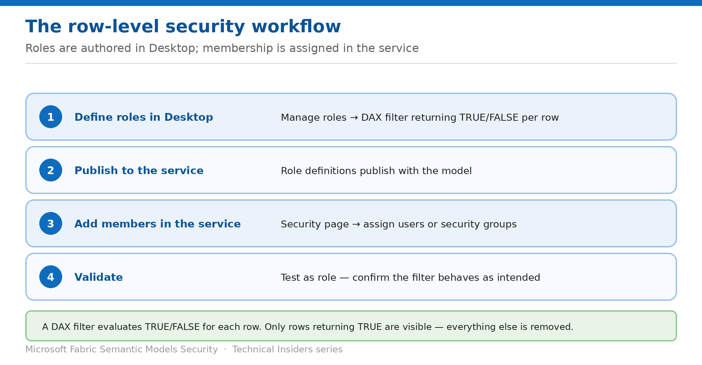

# Define Row-Level Security Roles

> Author DAX filters in Desktop, assign membership in the service, validate before you ship.

*Series: Row & object security · Layer 2 (1 of 4) · Audience: Model authors · Level 300*

This entry walks through the full **row-level security** workflow for a semantic model: defining roles with DAX filters in Power BI Desktop, publishing, assigning members in the service, and validating the result.

## Scenario — when to use this

One sales model serves every region. Each regional team should see only their own rows, and maintaining a separate model per region is neither sustainable nor consistent.

Reach for this pattern when the restriction is about which rows a consumer may see. Confirm first that your audience holds the **Viewer** role (entry 02), or the rules will never apply.

For more detail on how this option works, see:

- [Microsoft Fabric security white paper — Microsoft Learn](https://learn.microsoft.com/en-us/fabric/security/white-paper-landing-page)
- [Row-level security (RLS) with Power BI — Microsoft Learn](https://learn.microsoft.com/en-us/fabric/security/service-admin-row-level-security)

## What you'll set up

- RLS roles defined with DAX filter expressions.
- Members assigned to those roles in the service.
- Validation that each audience sees the intended rows.



*Figure 4 — Roles are authored in Desktop; membership is assigned in the service.*

## Prerequisites

- The model was created with **Power BI Desktop** — you can define RLS only on models created there. Excel-created models must be converted to PBIX first.
- The model uses **Import** or **DirectQuery**. Live connections to Analysis Services are handled in the underlying model instead.
- Your target audience holds the **Viewer** workspace role.
- You hold **Contributor** or higher in the workspace to assign role membership.

## Step 1 — Define the role in Power BI Desktop

1. Import data, or configure a DirectQuery connection.
2. On the **Modeling** tab, select **Manage Roles**.
3. Select **New**, name the role, and press enter. **Names can't contain a comma.**
4. Under **Select tables**, choose the table to filter.
5. Under **Filter data**, define the rule using the default editor — or switch to the **DAX editor** for expressions the default editor can't express.
6. Select **Save**.

A DAX filter evaluates **TRUE/FALSE for each row**. Only rows returning TRUE are visible; everything else is completely removed.

```dax
// Static filter — a fixed value
[Region] = "West"
```

> **When you need the DAX editor** — The default editor can't express dynamic rules using `username()` or `userprincipalname()`. Switch to the DAX editor for those — and note that switching back may lose information, so continue editing that role in DAX.

## Step 2 — Publish and assign members

1. Publish the model and report to the service — role definitions publish with the model.
2. In Fabric, hover the semantic model and select **More options → Security**.
3. Add members by typing an email address or name.
4. Repeat per role.

Supported group types for RLS role membership:

- **Distribution group**
- **Mail-enabled group**
- **Microsoft Entra security group**
- **Microsoft 365 groups aren't supported** and can't be added to any RLS role.
- Groups created **in Power BI** can't be added either.

## Step 3 — Understand bi-directional filtering

By default RLS filtering uses **single-directional** filters, whether relationships are set to single or bi-directional. To change that, select the relationship and check **Apply security filter in both directions**.

- Select this when you've implemented dynamic RLS at the server level, based on username or login ID.
- If a table takes part in multiple bi-directional relationships, you can only select this for **one** of them.
- **Enabling bi-directional security filtering can negatively impact query performance**, especially in models with many relationships or large datasets. Test before deploying.

## Validate

- Use **Test as role** and confirm only matching rows appear.
- Visuals, tables and charts reflect the filtered data, not the full dataset.
- A user in no RLS role sees **no data** — expected behaviour, since RLS is enforced but no role applies.
- A Contributor sees everything, confirming the bypass from entry 02.

## Limitations & gotchas

- **RLS only applies to Viewers.**
- **Service principals can't be added to an RLS role** — RLS isn't applied for apps using a service principal as the effective identity.
- Roles previously defined in the service must be **re-created in Power BI Desktop**.
- Only **Import** and **DirectQuery** are supported; Analysis Services live connections are handled in the model.
- **Microsoft 365 groups aren't supported** for role membership.
- Role names can't contain a comma.
- For **Direct Lake** models RLS is supported, but if a DAX query falls back to DirectQuery due to unsupported features, filters still apply while performance characteristics change.

## Rollback

1. Remove members from the role on the **Security** page using the X next to their name.
2. Delete the role in Power BI Desktop and republish to remove it entirely.
3. Verify that consumers regain the access you intended.

## References

- [Row-level security (RLS) with Power BI — Microsoft Learn](https://learn.microsoft.com/en-us/fabric/security/service-admin-row-level-security)
- [Roles in workspaces in Microsoft Fabric — Microsoft Learn](https://learn.microsoft.com/en-us/fabric/fundamentals/roles-workspaces)
