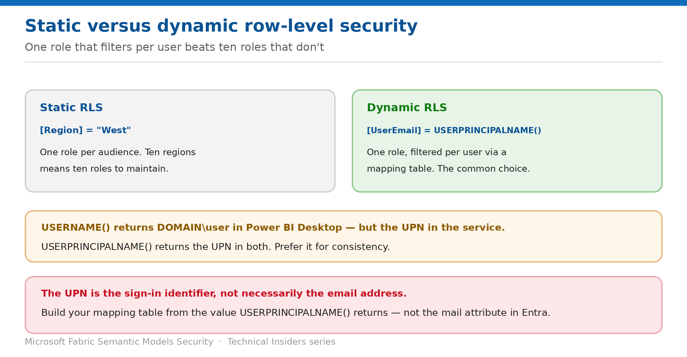

# Implement Dynamic Row-Level Security

> One role that filters per user, driven by USERPRINCIPALNAME() and a mapping table.

*Series: Row & object security · Layer 2 (2 of 4) · Audience: Model authors · Level 300*

Static RLS needs one role per audience. **Dynamic RLS** needs one role total, filtering per user against a mapping table in your model. This entry covers the DAX functions, the mapping-table design, and the identifier trap that breaks most first attempts.

## Scenario — when to use this

You have forty sales territories. Static RLS means forty roles to create, forty membership lists to maintain, and a change request every time someone moves territory.

Reach for this pattern whenever the number of audiences is more than a handful, or membership changes often. Microsoft describes dynamic RLS as the most common approach for exactly this reason.

For more detail on how this option works, see:

- [Microsoft Fabric security white paper — Microsoft Learn](https://learn.microsoft.com/en-us/fabric/security/white-paper-landing-page)
- [Row-level security (RLS) with Power BI — Microsoft Learn](https://learn.microsoft.com/en-us/fabric/security/service-admin-row-level-security)

## What you'll set up

- A single RLS role that filters per user.
- A mapping table keyed on the correct identifier.
- Validation with real identities, not just your own.



*Figure 5 — One role, filtered per user, beats ten roles you have to maintain.*

## Prerequisites

- A model created in **Power BI Desktop** with Import or DirectQuery.
- A **user-mapping table** relating identities to the scope they may see.
- Proper **relationships** configured between the mapping table and the fact table.
- Your audience holds the **Viewer** workspace role.

## Step 1 — Choose the right function

| Function | In Power BI Desktop | In the Power BI service |
| --- | --- | --- |
| USERNAME() | DOMAIN\User | The user's UPN |
| USERPRINCIPALNAME() | user@contoso.com | The user's UPN |
| CUSTOMDATA() | n/a | Custom string passed by an embedding app |

> **Prefer USERPRINCIPALNAME()** — `USERNAME()` returns different formats in Desktop and the service, which makes local testing misleading. `USERPRINCIPALNAME()` returns the UPN in both — use it for consistency.

## Step 2 — Write the filter

The common form compares a column in your mapping table to the signed-in identity:

```dax
// Dynamic RLS with UPN
[UserEmail] = USERPRINCIPALNAME()
```

Other supported patterns:

```dax
// Filter on the user's domain and username
[UserDomain] = USERNAME()

// Embedded scenarios, where the app passes an effective identity string
[AppRole] = CUSTOMDATA()
```

- **`CUSTOMDATA()` is primarily for embedded scenarios**, where the application passes a custom effective identity string via the Power BI REST API.
- Use **commas** to separate DAX function arguments even in locales that normally use semicolons, such as French or German.

## Step 3 — Build the mapping table correctly

This is where dynamic RLS most often fails silently:

1. Determine the value `USERPRINCIPALNAME()` actually returns in your tenant — add a card visual showing it if unsure.
2. Populate the mapping table with **that** value, not the `mail` attribute from Microsoft Entra ID.
3. Relate the mapping table to the fact table so the filter propagates.
4. Confirm the relationship direction carries the filter where you need it (entry 04 covers bi-directional filtering).

> **UPN is not always the email address** — The value returned by `USERPRINCIPALNAME()` is the user's **sign-in identifier**, not necessarily their email. For most users these match, but they differ when a user's email is an alias. Build the mapping table from the UPN.

## Validate

- **Test as role** returns the rows expected for the identity shown in **Now viewing as**.
- A card visual displaying `USERPRINCIPALNAME()` matches a row in your mapping table.
- A user whose identity has no mapping row sees no data — expected, and worth designing for.
- DAX string comparisons are case-insensitive by default, but verify your source hasn't introduced case-sensitive values.

## Limitations & gotchas

- **Mapping on the Entra `mail` attribute instead of the UPN** is the most common cause of "no data".
- `USERNAME()` behaves differently in Desktop and the service.
- **Service principals can't be added to RLS roles**, so dynamic RLS doesn't apply to service-principal apps.
- The default role editor can't express these functions — use the DAX editor.
- For B2B guests, UPN resolution has additional complications — see entry 10.

## Rollback

1. Revert the role to a static filter, or remove it and republish.
2. Correct the mapping table rather than abandoning dynamic RLS — the design is rarely the problem.

## References

- [Row-level security (RLS) with Power BI — Microsoft Learn](https://learn.microsoft.com/en-us/fabric/security/service-admin-row-level-security)
