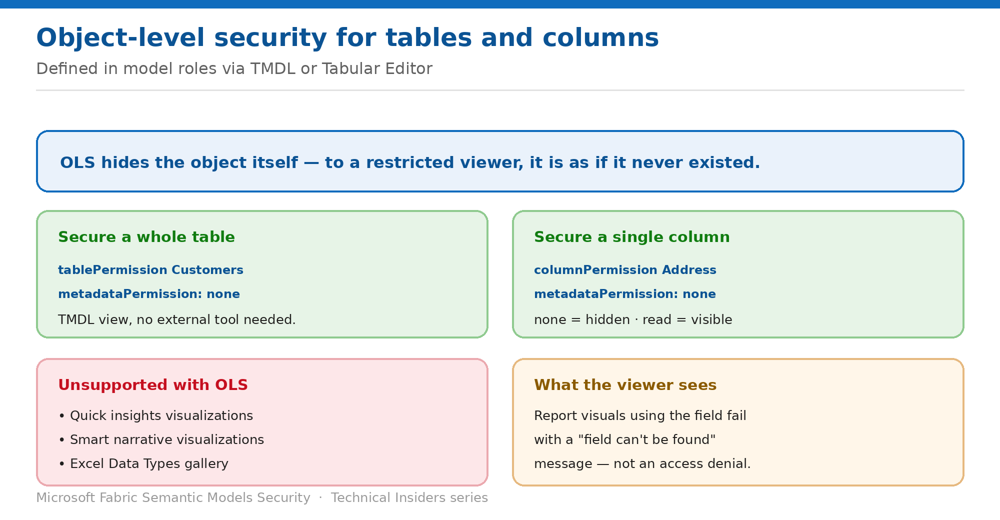

# Secure Tables and Columns with Object-Level Security

> Hide the object and its metadata so restricted viewers never know it exists.

*Series: Row & object security · Layer 2 (3 of 4) · Audience: Model authors · Level 300*

**Object-level security** secures specific tables or columns from report viewers — including their names and metadata. For viewers without the required access, **it's as if the secured objects don't exist**. This entry covers defining OLS with TMDL and with Tabular Editor.

## Scenario — when to use this

A model contains a salary column and an employee-records table. Hiding them in the report isn't security — a viewer with Build can still find them in the field list, or through Analyze in Excel.

Reach for this pattern when the existence of a table or column is itself sensitive, or when you need to prevent discovery of business-critical information rather than just restrict its values.

For more detail on how this option works, see:

- [Microsoft Fabric security white paper — Microsoft Learn](https://learn.microsoft.com/en-us/fabric/security/white-paper-landing-page)
- [Object-level security (OLS) with Power BI — Microsoft Learn](https://learn.microsoft.com/en-us/fabric/security/service-admin-object-level-security)

## What you'll set up

- Tables or columns secured for specific roles.
- Metadata hidden, not just values.
- Role membership assigned in the service.



*Figure 6 — TMDL or Tabular Editor, and what the restricted viewer actually sees.*

## Prerequisites

- A model with roles already defined (entry 04).
- Access to **TMDL view** in your authoring environment, or **Tabular Editor** installed.
- Your audience holds the **Viewer** workspace role — OLS only applies to Viewers.
- An understanding of which features become unsupported (see limitations).

## Step 1 — Define OLS with TMDL view

TMDL view lets you define OLS rules directly in the model without external tools.

1. Open **TMDL view** in your authoring environment.
2. Create a new TMDL script tab.
3. Write a `createOrReplace` script defining a role with the appropriate `metadataPermission`.
4. Use the **Preview** button to review the changes before applying.
5. Select **Apply** to execute the script against the model.
6. Publish the model to the service.

To secure an entire table:

```text
createOrReplace
  role CategoriesOLS
    modelPermission: read

    tablePermission Customers
      metadataPermission: none
```

To secure a specific column:

```text
createOrReplace
  role CategoriesOLS
    modelPermission: read

    tablePermission Customers
      columnPermission Address
        metadataPermission: none
```

- **`none`** — OLS is enforced and the table or column is hidden from that role.
- **`read`** — the table or column is visible to that role.

## Step 2 — Or define OLS with Tabular Editor

1. In Power BI Desktop, create the model and the roles that define your OLS rules.
2. On the **External tools** ribbon, select **Tabular Editor** — install it if the button isn't present.
3. In **Model view**, expand the dropdown under **Roles**.
4. Select the role, and expand **Table Permissions**.
5. Set the permission for the table or column to **None** or **Read**.
6. Save your changes, then publish the model from Power BI Desktop.

## Step 3 — Assign members in the service

1. In the Power BI service, select **More options (...)** for the semantic model.
2. Select the **Security** page.
3. Assign members or groups to their appropriate roles.

## Validate

- A restricted viewer opening a report using the secured field receives a **"field can't be found"** message for those visuals.
- The secured table or column doesn't appear in the field list for that role.
- A permitted role sees the object normally.
- A Contributor sees everything, confirming OLS applies only to Viewers.

## Limitations & gotchas

- **OLS only applies to Viewers** — Admin, Member and Contributor have Edit permission, so it doesn't apply to them.
- Models with OLS configured **aren't supported** with: **Quick insights visualizations**, **Smart narrative visualizations**, and the **Excel Data Types gallery**.
- Restricted viewers see a field-not-found error rather than an access-denied message — brief your support desk.
- Switching a role between TMDL and the default editor may lose information.
- OLS in a Direct Lake model applies only within that model — see entry 09.

## Rollback

1. Set `metadataPermission` back to `read` for the object, or change the Tabular Editor permission to **Read**.
2. Republish the model.
3. Confirm reports using the field render correctly again.

## References

- [Object-level security (OLS) with Power BI — Microsoft Learn](https://learn.microsoft.com/en-us/fabric/security/service-admin-object-level-security)
- [Row-level security (RLS) with Power BI — Microsoft Learn](https://learn.microsoft.com/en-us/fabric/security/service-admin-row-level-security)
