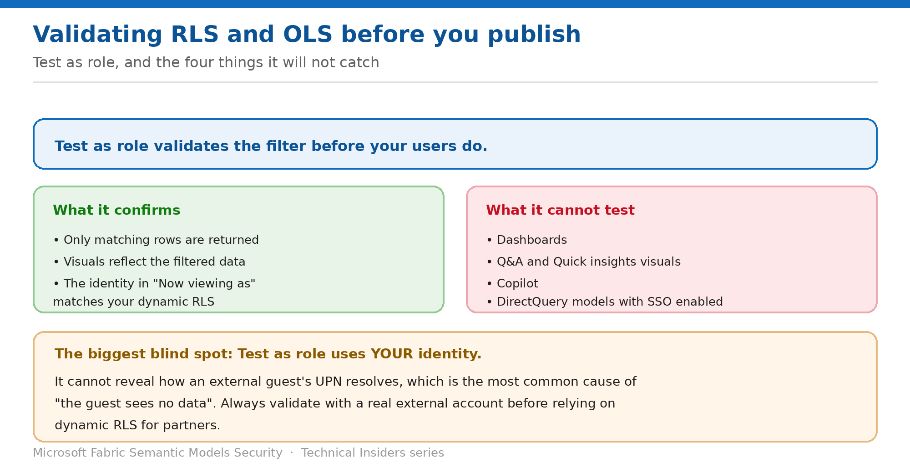

# Validate RLS and OLS Before You Publish

> Test as role — and the four things it will not catch.

*Series: Row & object security · Layer 2 (4 of 4) · Audience: Model authors · Level 300*

This entry covers validating your security rules with **Test as role**, reading the results correctly, and knowing which scenarios the feature cannot verify — including the one that causes most production surprises.

## Scenario — when to use this

Your RLS tests pass. You ship. A partner opens the report and sees nothing, or an executive opens a dashboard and the filter doesn't behave as it did in testing.

Reach for this entry before every publish, and especially before sharing a model outside your own tenant.

For more detail on how this option works, see:

- [Microsoft Fabric security white paper — Microsoft Learn](https://learn.microsoft.com/en-us/fabric/security/white-paper-landing-page)
- [Row-level security (RLS) with Power BI — Microsoft Learn](https://learn.microsoft.com/en-us/fabric/security/service-admin-row-level-security)

## What you'll set up

- Each role validated against its intended audience.
- An understanding of what the test cannot cover.
- A supplementary test plan for the gaps.

*Figure 7 — What the built-in test confirms, and its blind spots.*

## Prerequisites

- RLS or OLS roles defined and published.
- A report in the **same workspace** as the model — you can only test reports located there.
- Contributor or higher, to reach the Security page.

## Step 1 — Run Test as role

1. Open the semantic model's **Security** page.
2. Select **More options (...)** next to the role.
3. Select **Test as role**.
4. You're redirected to the report published with this model.
5. Use **Now viewing as** to test other roles, a combination of roles, or a specific person.
6. Select **Viewing** in the page header to test other reports connected to the model.
7. Select **Back to Row-Level Security** to return to normal viewing.

## Step 2 — Check the right things

- The report displays **only data rows matching the filter expression** defined in the role.
- **Visuals, tables and charts reflect the filtered data**, not the full dataset.
- For dynamic RLS, the data corresponds to the identity shown in the **Now viewing as** header.
- The role being applied is shown in the page header.

## Step 3 — Know what it cannot test

- **Dashboards** aren't available for testing with Test as role.
- **Q&A visualizations**, **Quick insights visualizations** and **Copilot** can't be validated.
- **DirectQuery models with single sign-on (SSO) enabled** aren't supported — sign in as an actual Viewer-role user instead.
- **External guest UPN resolution** — because Test as role uses **your own identity**.

> **The blind spot that matters most** — Test as role cannot reveal how an external guest's UPN resolves. That is the single most common cause of "the partner sees no data", and the only way to catch it is to test with a real external account (entry 10).

## Step 4 — Troubleshoot a failing test

1. Verify the **DAX filter syntax** is correct and references the right column names.
2. Confirm you selected the **correct role** to test.
3. For dynamic RLS, confirm the mapping table contains matching values for `USERPRINCIPALNAME()` or `USERNAME()`.
4. For DirectQuery models with SSO, sign in as an actual Viewer-role user rather than relying on the test.
5. If a user sees **more** data than expected, confirm they're assigned to an RLS role at all — and check they aren't a Contributor.

## Validate

- Each role returns its intended row set.
- A combination of roles behaves as designed.
- An unassigned identity returns no data.
- A real Viewer-role user confirms the same behaviour outside the test harness.

## Limitations & gotchas

- **Test as role uses your identity** — it cannot validate external users.
- Dashboards, Q&A, Quick insights and Copilot are outside its scope.
- DirectQuery with SSO isn't supported by the feature.
- You can only test reports in the **same workspace** as the model.
- A passing test doesn't prove the audience holds the Viewer role — check that separately (entry 02).

## Rollback

1. Testing is non-destructive; select **Back to Row-Level Security** to exit.
2. If the test revealed a problem, correct the role definition in Desktop and republish.

## References

- [Row-level security (RLS) with Power BI — Microsoft Learn](https://learn.microsoft.com/en-us/fabric/security/service-admin-row-level-security)
- [Object-level security (OLS) with Power BI — Microsoft Learn](https://learn.microsoft.com/en-us/fabric/security/service-admin-object-level-security)
