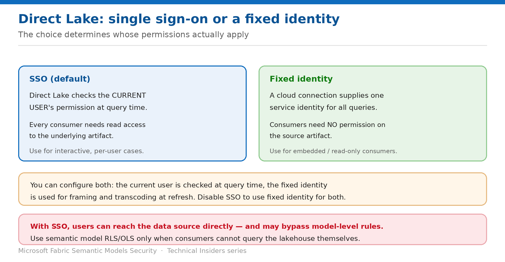

# Choose SSO or a Fixed Identity for Direct Lake

> The connection setting that decides whose permissions actually apply.

*Series: Connection identity · Layer 3 (1 of 2) · Audience: Model authors & admins · Level 300*

A Direct Lake model checks the **effective identity** before returning data — and which identity that is depends entirely on your connection configuration. This entry covers the choice between **SSO** and a **fixed identity**, and what each requires downstream.

## Scenario — when to use this

You want consumers to read a Direct Lake report without giving every one of them access to the underlying lakehouse. Or the opposite: you want per-user authorization enforced at the source. These are different connection configurations, and picking the wrong one either over-grants or breaks the report.

Reach for this entry when building any Direct Lake model, and before deciding where to enforce your data-access rules (entry 09).

For more detail on how this option works, see:

- [Microsoft Fabric security white paper — Microsoft Learn](https://learn.microsoft.com/en-us/fabric/security/white-paper-landing-page)
- [Integrate Direct Lake security — Microsoft Learn](https://learn.microsoft.com/en-us/fabric/fundamentals/direct-lake-security-integration)

## What you'll set up

- A deliberate choice between SSO and a fixed identity.
- The correct permissions granted for that choice.
- Both modes tested before production.

*Figure 8 — Two authentication modes with very different permission requirements.*

## Prerequisites

- A Direct Lake semantic model over a lakehouse or warehouse.
- Ability to create or edit cloud connections in the Power BI service.
- Knowledge of whether consumers should be able to query the source directly.

## Step 1 — Understand the two modes

- **SSO (default)** — Direct Lake checks that the **current user** querying the model has read access to the data. Only users with read access can query it.
- **Fixed identity** — you bind the model to an explicit cloud connection. Direct Lake doesn't require every user to have read permission on the underlying data; the fixed identity's permissions determine what it can access.

You can configure a connection to use **both**: the current user's permissions are checked at query time, and the fixed identity is used for framing and transcoding at refresh time. To use the fixed identity for both, **disable SSO** in the connection.

> **Microsoft's guidance** — Use **SSO** for interactive scenarios where per-user authorization is required. Use a **fixed-identity cloud connection** for embedded or read-only consumer scenarios where source-level access is scoped to a single service account.

## Step 2 — Set the authentication method

1. Open the semantic model settings and expand the data connection configuration.
2. Choose **OAuth 2.0**, **Service Principal**, or **Workspace Identity** as the authentication method.
3. For a fixed identity, bind the model to an explicit cloud connection and **disable SSO**.
4. Apply and refresh.

> **Other methods aren't supported** — Key or SAS authentication **might appear in the configuration UI but aren't supported** for Direct Lake models. Use only OAuth 2.0, Service Principal, or Workspace Identity.

## Step 3 — Grant the matching permissions

Permission requirements differ between Direct Lake on SQL endpoints and Direct Lake on OneLake:

| Goal | Direct Lake on SQL endpoints | Direct Lake on OneLake |
| --- | --- | --- |
| Users view reports | Read on report and model; with SSO, Read on the artifact and SELECT on tables | Read on report and model; with SSO, Read on the artifact plus a OneLake security role or ReadAll |
| Users create reports | Build on the model; with SSO, Read on the artifact and SELECT on tables | Build on the model; with SSO, Read on the artifact plus a OneLake role or ReadAll |
| Users query the model but not the source | Fixed identity with SSO disabled; grant the identity Read and SELECT; grant users nothing on the artifact | Fixed identity with SSO disabled; grant the identity Read plus a OneLake role or ReadAll |

## Step 4 — Don't forget the model owner

Beyond the effective identity, **Direct Lake requires the semantic model owner to have read access to the source tables** so the model can be framed during refresh. No matter who triggers the refresh, Direct Lake checks the owner's permission.

If the owner lacks access, framing fails with an error naming the restricted tables and stating that the owner must have read access to them.

## Validate

- With **SSO**, a user without source access cannot query the model.
- With a **fixed identity and SSO disabled**, the same user can query the model but not the lakehouse.
- A refresh completes, confirming the owner has the required read access.
- Test **both** authentication modes before production, as Microsoft recommends.

## Limitations & gotchas

- **Key and SAS authentication aren't supported** for Direct Lake despite appearing in the UI.
- **The model owner needs read access to source tables** or framing fails.
- With SSO, users can reach the data source directly and **may bypass model-level rules** (entry 09).
- **Direct Lake on OneLake doesn't support fallback to DirectQuery** — if a SQL endpoint table enforces RLS or a query exceeds capacity guardrails, visuals fail rather than falling back.
- For internal shortcuts on SQL endpoints, the **data source owner's** identity reads the Delta table — they need access at the target.

## Rollback

1. Re-enable SSO in the connection to return to per-user checks.
2. Unbind the fixed-identity cloud connection.
3. Re-grant source permissions to consumers if you switch back to SSO.

## References

- [Integrate Direct Lake security — Microsoft Learn](https://learn.microsoft.com/en-us/fabric/fundamentals/direct-lake-security-integration)
- [Data security overview (OneLake) — Microsoft Learn](https://learn.microsoft.com/en-us/fabric/onelake/security/get-started-security)
