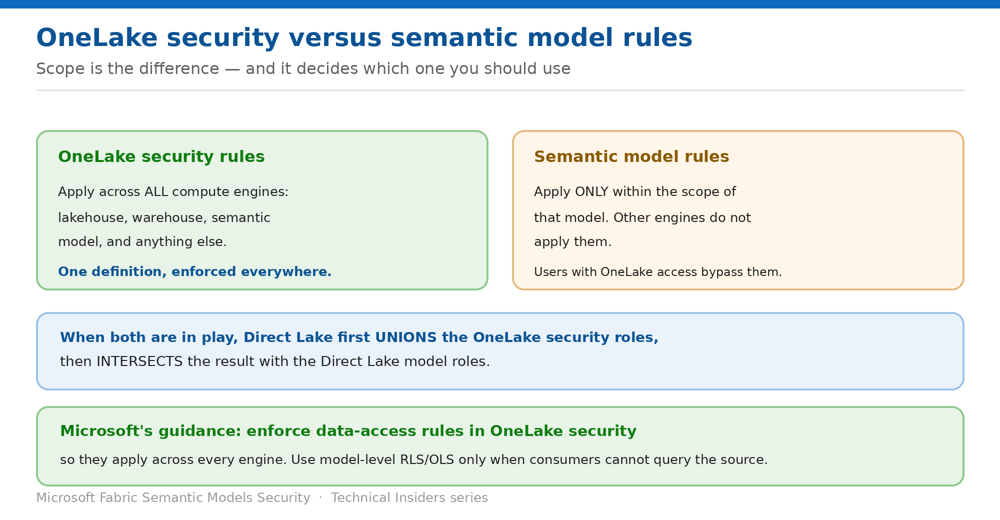

# Align Direct Lake Models with OneLake Security

> Where to define your rules so they hold across every engine, not just this model.

*Series: Connection identity · Layer 3 (2 of 2) · Audience: Model authors & admins · Level 300*

You can define RLS and OLS in **OneLake security**, in the **Direct Lake model**, or in both. This entry covers what changes depending on where you put them — and why the answer usually isn't the model.

## Scenario — when to use this

You've implemented careful RLS in your semantic model. A consumer opens the lakehouse directly, or queries the SQL analytics endpoint, and sees everything — because model-level rules don't extend beyond the model.

Reach for this entry when deciding where data-access rules should live, and whenever a user sees different data through different tools.

For more detail on how this option works, see:

- [Microsoft Fabric security white paper — Microsoft Learn](https://learn.microsoft.com/en-us/fabric/security/white-paper-landing-page)
- [Integrate Direct Lake security — Microsoft Learn](https://learn.microsoft.com/en-us/fabric/fundamentals/direct-lake-security-integration)
- [Data security overview (OneLake) — Microsoft Learn](https://learn.microsoft.com/en-us/fabric/onelake/security/get-started-security)

## What you'll set up

- Rules placed where their scope matches your requirement.
- An understanding of how the two rule sets combine.
- Consistent access regardless of the tool a consumer uses.

*Figure 9 — Scope is the difference between the two rule locations.*

## Prerequisites

- A Direct Lake semantic model over a lakehouse or warehouse.
- Ability to create **OneLake security roles** — workspace Admin or Member.
- Knowledge of whether consumers can query the source directly.

## Step 1 — Understand the scope difference

- **OneLake security rules apply across all compute engines** — lakehouse, warehouse, semantic model, or any other artifact. One definition, enforced everywhere.
- **Semantic model rules apply only within that model.** Other compute engines don't apply them, which produces different results when users access the data by another path.

> **The consequence** — When you use both, **users who have OneLake access can still retrieve and work with the data even if Direct Lake model rules further restrict it** — because model-level rules don't extend beyond the model.

## Step 2 — Choose where the rules live

Microsoft's guidance is unambiguous:

- **If you must enforce data-access rules, do so in OneLake security** so they apply across all compute engines and provide unified access control.
- **Use semantic model RLS or OLS when report consumers aren't granted permission to query the lakehouse or warehouse, and the cloud connection uses a fixed identity instead of SSO.**
- SSO implies end users can access the data source directly, and might therefore bypass rules defined in the model.

That gives a simple decision rule: **fixed identity plus no source access → model rules are fine. Anything else → put the rules in OneLake security.**

## Step 3 — Know how the two combine

If the effective identity belongs to roles in both places, Direct Lake resolves them in a specific order:

- It first **unions** the OneLake security roles.
- It then **intersects** that result with the Direct Lake model roles.

Common symptoms when the two conflict:

| Symptom | Usual cause |
| --- | --- |
| No rows returned | The effective identity lacks row-level access; RLS filters exclude all rows for that user |
| Can't find table / Column can't be found | Object permissions missing after applying OneLake security roles |
| Failed to resolve name / Not a valid table | The same — missing object permissions after role application |

## Step 4 — Account for metadata discovery

OneLake OLS hides data, but semantic model **metadata** is a separate exposure:

- Users with **build or higher** permissions can view model metadata via **XMLA** and **REST APIs**.
- OneLake security applies only to members of the workspace **Viewer** role, so **Contributors and above can discover secured tables and columns** — they already have Write permission to all workspace artifacts.
- Viewers with build or higher on a Direct Lake model **can discover sensitive schema information through the model metadata**. They have no data access, but can see that the objects exist.
- **Git integration** preserves workspace structure, so developers can see that secured tables or columns exist in the repository metadata even without data access.

## Validate

- A restricted user sees the same filtered data through the **model**, the **lakehouse**, and the **SQL analytics endpoint** when rules are in OneLake security.
- With model-only rules, the same user sees **more** through the lakehouse — demonstrating the scope limit.
- A user in roles on both sides receives the union-then-intersect result.
- Metadata discovery behaves as you expect for Viewers with Build.

## Limitations & gotchas

- **Model rules don't extend beyond the model** — the central limitation of this entry.
- **Direct Lake doesn't support SQL analytics endpoint OLS/RLS in memory.** A query touching an object restricted by endpoint OLS or CLS returns an error; a query referencing a table with endpoint RLS or a view **falls back to DirectQuery**.
- **If DirectQuery fallback is disabled**, queries depending on endpoint RLS or views fail.
- **Direct Lake on OneLake doesn't support fallback at all** — those queries return errors.
- Contributors and above bypass OneLake security and can discover secured objects.
- Queries sent to the SQL analytics endpoint **bypass data-access permissions enforced by the semantic model**.

## Rollback

1. Remove the OneLake security role to revert to prior access, understanding this affects every engine.
2. Remove model-level RLS/OLS by editing roles and republishing.
3. Re-test through every access path after any change.

## References

- [Integrate Direct Lake security — Microsoft Learn](https://learn.microsoft.com/en-us/fabric/fundamentals/direct-lake-security-integration)
- [Data security overview (OneLake) — Microsoft Learn](https://learn.microsoft.com/en-us/fabric/onelake/security/get-started-security)
