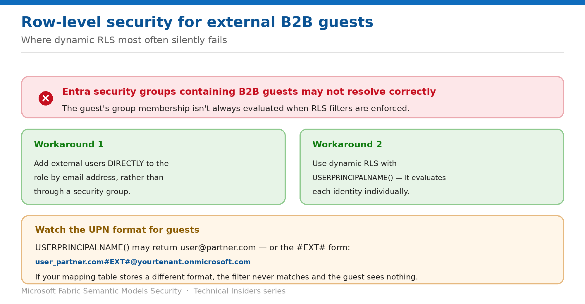

# Apply Row-Level Security to External B2B Guests

> Where dynamic RLS silently fails, and the two supported workarounds.

*Series: Governance & sharing · Layer 4 (1 of 2) · Audience: Model authors & admins · Level 300*

Sharing a secured model with partners through **Microsoft Entra B2B** introduces two failure modes that don't exist internally: security group membership may not resolve, and the guest's UPN may not match your mapping table. This entry covers both.

## Scenario — when to use this

You share a report with a partner. They open it and see nothing. Your RLS is correct, Test as role passes, and internal users are fine — but the guest's identity never matched a row in your mapping table.

Reach for this entry before sharing any RLS-secured model externally, and as the first diagnostic when a guest reports an empty report.

For more detail on how this option works, see:

- [Microsoft Fabric security white paper — Microsoft Learn](https://learn.microsoft.com/en-us/fabric/security/white-paper-landing-page)
- [Row-level security (RLS) with Power BI — Microsoft Learn](https://learn.microsoft.com/en-us/fabric/security/service-admin-row-level-security)

## What you'll set up

- External guests correctly filtered rather than seeing nothing.
- Role membership assigned in a way that resolves for guests.
- A validated mapping table keyed on the right identifier.



*Figure 10 — Group membership and UPN format are the two failure points.*

## Prerequisites

- RLS roles defined and published (entry 04).
- External users invited through **Microsoft Entra B2B**.
- Access to a **real external guest account** for testing — this is not optional here.

## Step 1 — Avoid group-based membership for guests

**Entra security groups that contain external B2B guest users might not work as expected** when used for RLS role membership. Particularly where the external user has a guest-type rather than member-type account, the guest's group membership **isn't correctly evaluated** by the service when enforcing RLS filters.

- **Recommended workaround:** add external users **directly to the role by email address** rather than through a security group. The email resolves to the user's B2B account.
- **For many external users:** use **dynamic RLS with `USERPRINCIPALNAME()`** instead of group-based membership. It evaluates each identity individually and avoids group resolution entirely.

> **Audit existing group-based roles** — If you currently use Entra security groups for RLS role membership and those groups include B2B guests, verify the guests see correctly filtered data. If they don't, add them directly by email address.

## Step 2 — Handle UPN resolution

When an external guest accesses a report, `USERPRINCIPALNAME()` typically returns an email-like identifier such as `user@partner.com`. In some configurations it returns the guest UPN in **#EXT#** format:

```text
user_partner.com#EXT#@yourtenant.onmicrosoft.com
```

If your mapping table stores a different identifier format than what the function returns, **the filter never matches** and the guest sees no data or incorrect data.

- `USERNAME()` for B2B guests often returns a **UPN-like identifier similar to `USERPRINCIPALNAME()`** rather than domain\username.
- Because the two often return the same value for guests, **most implementations use `USERPRINCIPALNAME()` for consistency**.
- Store the value the function returns — **not** the `mail` attribute from Entra.

## Step 3 — Troubleshoot an empty report

1. **Verify the returned UPN** — create a test measure using `USERPRINCIPALNAME()`, display it in a card visual, and have the guest view the report to see the actual value.
2. **Check the mapping table** contains a row exactly matching that value.
3. **Check case sensitivity** — DAX comparisons are case-insensitive by default, but verify the source hasn't introduced case-sensitive values.
4. **Review cross-tenant access settings** — these can affect which UPN format is presented.
5. **Test with the actual guest account**, since Test as role uses your own identity.
6. **Verify role assignment** — a guest seeing more than expected may not be assigned to any RLS role.

## Validate

- A real external guest sees exactly their intended rows.
- The card visual showing `USERPRINCIPALNAME()` matches a mapping-table row.
- A guest not assigned to any role sees no data, as expected.
- Internal users remain unaffected by the change.

## Limitations & gotchas

- **Entra security groups containing B2B guests may not resolve** for RLS role membership.
- **UPN format varies** — plain email or the `#EXT#` form, depending on configuration.
- **Test as role can't validate guests** because it uses your identity.
- UPN behaviour **varies with your Entra configuration**, including cross-tenant access settings and guest invitation type — always validate in your own environment.
- The exact scope of the group-membership limitation may vary by configuration.

## Rollback

1. Remove the guest from the RLS role on the **Security** page.
2. Revert to group-based membership only if you've confirmed it resolves correctly for your guests.
3. Remove external sharing entirely if the model shouldn't leave the tenant.

## References

- [Row-level security (RLS) with Power BI — Microsoft Learn](https://learn.microsoft.com/en-us/fabric/security/service-admin-row-level-security)
