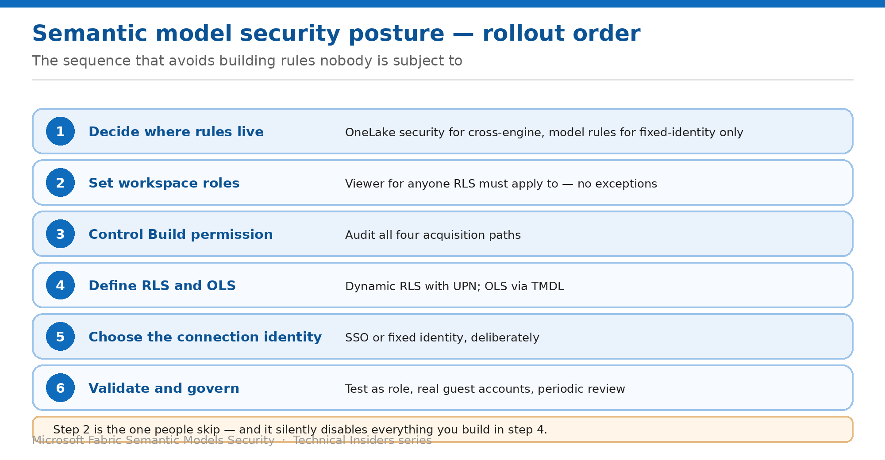

# Assemble a Semantic Model Security Posture

> The order to apply these controls in, starting with the one that decides whether any of them matter.

*Series: Governance & sharing · Layer 4 (2 of 2) · Audience: Fabric admins & architects · Level 300*

The preceding ten entries each solve one problem. This capstone puts them in order and adds the review cadence.

Semantic models have one sequencing rule that overrides the rest: **decide who holds Write before you write a single rule**. Rules authored for an audience that holds Contributor have never applied to anyone.

## Scenario — when to use this

You're securing a model estate, or auditing one you inherited. The temptation is to start with RLS because that's the visible control — and it's the wrong starting point.

Reach for this entry when planning a rollout, onboarding a new model, or reviewing an existing estate against a target posture.

For more detail on how this option works, see:

- [Microsoft Fabric security white paper — Microsoft Learn](https://learn.microsoft.com/en-us/fabric/security/white-paper-landing-page)
- [Row-level security (RLS) with Power BI — Microsoft Learn](https://learn.microsoft.com/en-us/fabric/security/service-admin-row-level-security)
- [Integrate Direct Lake security — Microsoft Learn](https://learn.microsoft.com/en-us/fabric/fundamentals/direct-lake-security-integration)

## What you'll set up

- A sequenced rollout plan across all four layers.
- A control map you can review a model against.
- A review cadence that keeps it accurate.

*Figure 11 — Rollout order, with the step people skip highlighted.*

## The rollout order

| # | Step | What you do | Entries |
| --- | --- | --- | --- |
| 1 | Decide where rules live | OneLake security for cross-engine; model rules only for fixed identity | 09 |
| 2 | Set workspace roles | Viewer for anyone the rules must apply to — no exceptions | 02 |
| 3 | Control Build permission | Audit all four acquisition paths | 01, 03 |
| 4 | Define RLS and OLS | Dynamic RLS with UPN; OLS via TMDL | 04, 05, 06 |
| 5 | Choose connection identity | SSO or fixed identity, deliberately | 08 |
| 6 | Validate and govern | Test as role, real guest accounts, periodic review | 07, 10 |

> **Step 2 is the one people skip** — Assigning Contributor for self-service silently disables everything you build in step 4. **Viewer plus Build permission** gives the same self-service capability with the rules intact — that pairing is the single most valuable takeaway in this series.

## Step 1 — Baseline the estate

1. List every semantic model and the workspace hosting it.
2. For each, record workspace role assignments and direct permission grants.
3. Flag every audience holding **Contributor or higher** that was supposed to be subject to RLS.
4. Record which models use **Direct Lake**, and whether the connection uses SSO or a fixed identity.
5. Record which models are shared **externally**.
6. Note where data-access rules currently live — model, OneLake security, or both.

## Step 2 — Apply the layers in order

1. **Decide rule location:** move enforcement to OneLake security unless consumers genuinely can't reach the source and you use a fixed identity (09).
2. **Fix workspace roles:** downgrade secured audiences to Viewer, granting Build where self-service is needed (02).
3. **Audit Build:** check all four acquisition paths and revoke where access has ended (03).
4. **Author rules:** dynamic RLS with `USERPRINCIPALNAME()` (05), OLS via TMDL for objects whose existence is sensitive (06).
5. **Set connection identity:** SSO for per-user authorization, fixed identity for read-only consumers (08).
6. **Validate:** Test as role for internal audiences (07), real guest accounts for external ones (10).

## Step 3 — Watch the interactions

- **Write permission disables data-access rules** — the root cause of most "RLS isn't working" reports.
- **Model rules don't extend beyond the model** — a consumer with lakehouse access bypasses them.
- **Direct Lake on OneLake has no DirectQuery fallback** — endpoint RLS or capacity guardrails produce errors, not degraded performance.
- **Service principals can't be in RLS roles** — apps using an SPN as the effective identity aren't filtered.
- **Viewers with Build can still discover schema metadata** via XMLA and REST, even without data access.
- **OLS breaks Quick insights, Smart narrative, and the Excel Data Types gallery.**

## End-to-end validation

- **Permissions:** every audience meant to be filtered holds Viewer; Build is granted deliberately.
- **Rules:** RLS returns the right rows per audience; OLS hides the intended objects.
- **Scope:** a restricted user sees the same data through the model, the lakehouse and the SQL endpoint.
- **Identity:** the Direct Lake connection mode matches your intent, and the model owner can read the source.
- **External:** a real guest account sees correctly filtered data.
- **Governance:** the baseline is documented and dated.

## Limitations & gotchas

- **RLS and OLS apply only to Viewers** — everything else follows from this.
- **Removing app access doesn't remove Build** — revoke separately.
- **Test as role can't validate external guests.**
- **Microsoft 365 groups aren't supported** for RLS role membership.
- **Queries to the SQL analytics endpoint bypass model-enforced permissions.**
- Direct Lake and OneLake security integration is evolving — re-verify before each publication cycle.

## Review cadence

1. Re-run the workspace role and permission baseline quarterly.
2. Re-validate RLS after any change to the mapping table or its source.
3. Re-test external guests whenever a new partner is onboarded.
4. Re-check Direct Lake connection identity after any capacity or workspace change.
5. Re-verify preview and recently-changed behaviour after each Fabric release.

## References

- [Row-level security (RLS) with Power BI — Microsoft Learn](https://learn.microsoft.com/en-us/fabric/security/service-admin-row-level-security)
- [Object-level security (OLS) with Power BI — Microsoft Learn](https://learn.microsoft.com/en-us/fabric/security/service-admin-object-level-security)
- [Build permission for shared semantic models — Microsoft Learn](https://learn.microsoft.com/en-us/power-bi/connect-data/service-datasets-build-permissions)
- [Integrate Direct Lake security — Microsoft Learn](https://learn.microsoft.com/en-us/fabric/fundamentals/direct-lake-security-integration)
- [Microsoft Fabric security white paper — Microsoft Learn](https://learn.microsoft.com/en-us/fabric/security/white-paper-landing-page)
