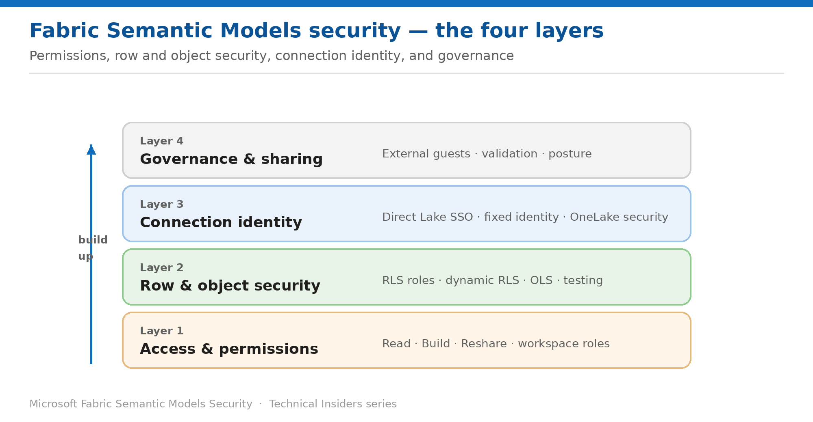

# Security for Fabric Semantic Models

*An 11-part, prescriptive how-to series for row-level security, object-level security, and Direct Lake.*

Each entry is a self-contained how-to (prerequisites → steps → validation → limitations → rollback) with its own architecture diagram, scoped to semantic models. Start at Layer 1 and work up.

## Contents

### Layer 1 — Access & permissions

- [Understand the Semantic Model Permission Model](Fabric-SM-Security-01-Access-Permission-Model.md) — Read, Build, Reshare and Write — and the one that silently disables your security rules.
- [Control Access with Workspace Roles](Fabric-SM-Security-02-Access-Workspace-Roles.md) — Why row-level security applies only to Viewers — and what that means for your design.
- [Manage Build Permission](Fabric-SM-Security-03-Access-Build-Permission.md) — Four ways users acquire it, and the one that survives removing app access.

### Layer 2 — Row & object security

- [Define Row-Level Security Roles](Fabric-SM-Security-04-Security-Row-Level-Security.md) — Author DAX filters in Desktop, assign membership in the service, validate before you ship.
- [Implement Dynamic Row-Level Security](Fabric-SM-Security-05-Security-Dynamic-RLS.md) — One role that filters per user, driven by USERPRINCIPALNAME() and a mapping table.
- [Secure Tables and Columns with Object-Level Security](Fabric-SM-Security-06-Security-Object-Level-Security.md) — Hide the object and its metadata so restricted viewers never know it exists.
- [Validate RLS and OLS Before You Publish](Fabric-SM-Security-07-Security-Validate.md) — Test as role — and the four things it will not catch.

### Layer 3 — Connection identity

- [Choose SSO or a Fixed Identity for Direct Lake](Fabric-SM-Security-08-Identity-Direct-Lake-SSO.md) — The connection setting that decides whose permissions actually apply.
- [Align Direct Lake Models with OneLake Security](Fabric-SM-Security-09-Identity-OneLake-Security.md) — Where to define your rules so they hold across every engine, not just this model.

### Layer 4 — Governance & sharing

- [Apply Row-Level Security to External B2B Guests](Fabric-SM-Security-10-Governance-External-Guests.md) — Where dynamic RLS silently fails, and the two supported workarounds.
- [Assemble a Semantic Model Security Posture](Fabric-SM-Security-11-Governance-Posture.md) — The order to apply these controls in, starting with the one that decides whether any of them matter.

---

*See the [series overview](Fabric-SM-Security-00-Series-Overview.md) for the complete entry list and where to start.*
